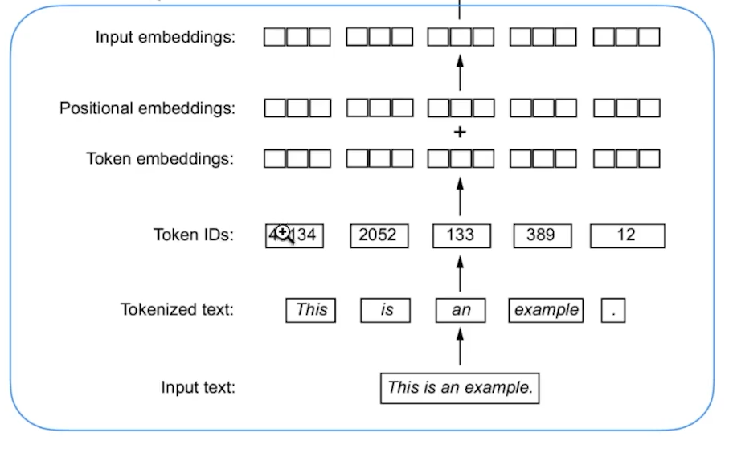

# SLM
Small Language Model from Scratch

This repo holds code to build a small language model from Scratch

Flow:
TokenizeEmbeddings
    Input text -> Tokenized Text-> Token IDs -> Token Embeddings -> Positional Embeddings -> Input Embeddings
    Chapter 2
    

To get started
1) install the packages using command
pip install -r requirements.txt