# SLM

## 1. Small Language Model from Scratch

This repository contains code for building a small language model from scratch.
It follows the concepts and implementation presented in
[LLMs from Scratch](https://github.com/rasbt/LLMs-from-scratch).


## 2. Architecture Flow

### 2.1 Tokenization and Embeddings

1. Input text
2. Tokenized text
3. Token IDs
4. Token embeddings
5. Positional embeddings
6. Input embeddings


### 2.2 Attention Mechanism

1. Simplified self-attention
2. Self-attention with trainable weights
3. Causal attention
4. Multi-head attention


### 2.3 LLM Architecture


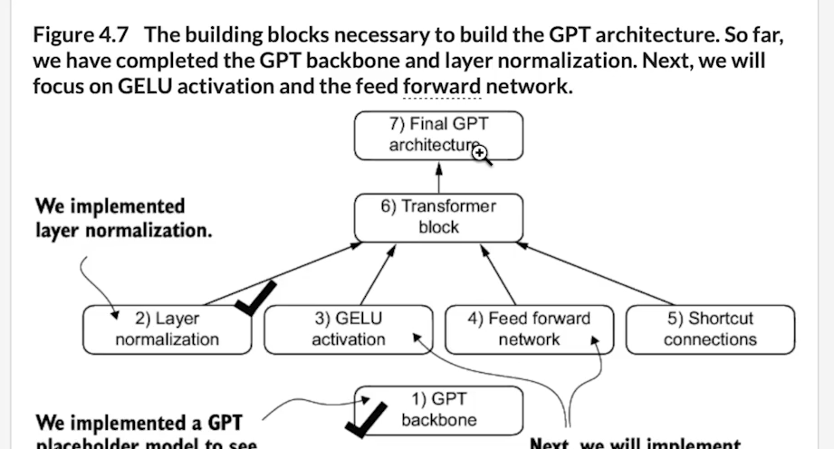

#### 2.3.1 Layer Normalization


#### 2.3.2 Transformer Block Internals


#### 2.3.3 Shortcut Connections

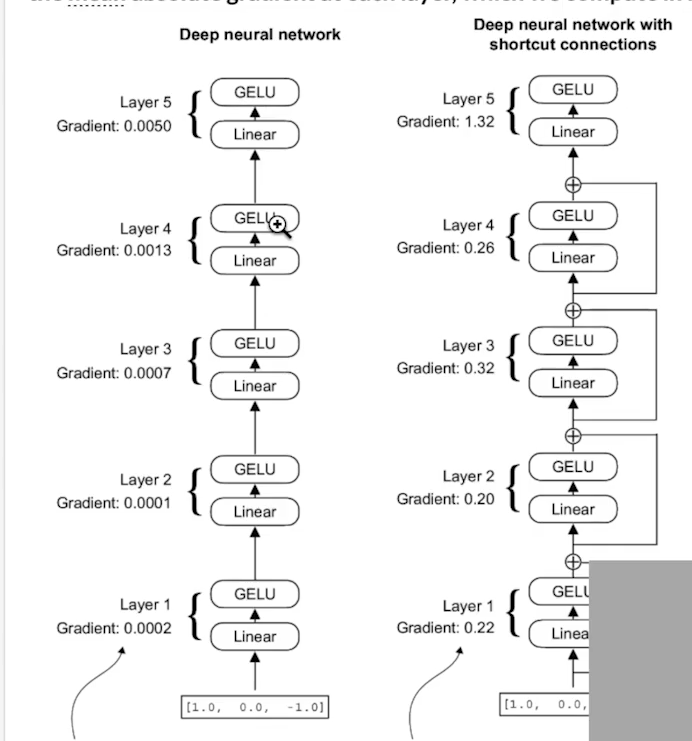

#### 2.3.4 Transformer Block


#### 2.3.5 GPT Model and Text Generation

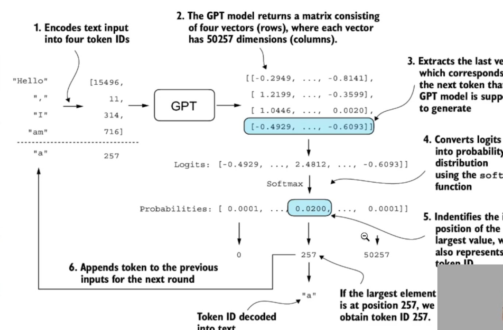

### 2.4 Loss and Training Loop

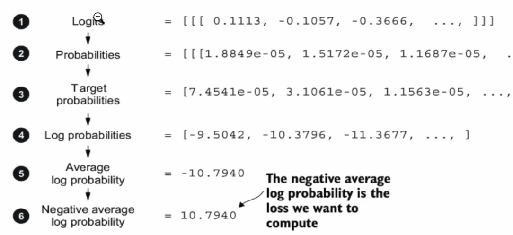

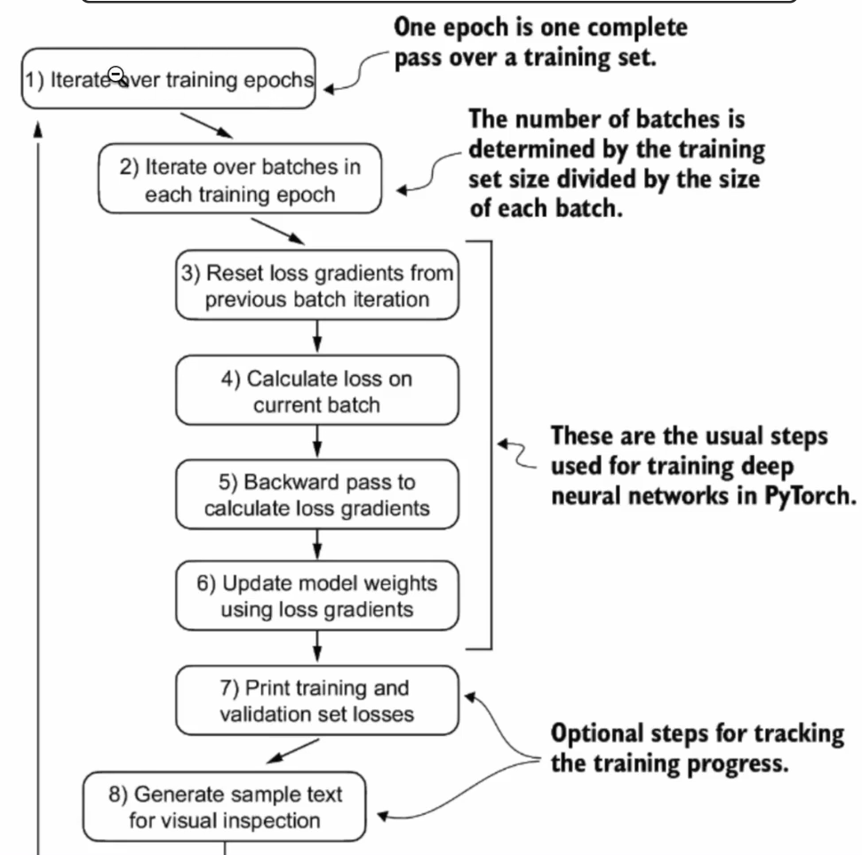

### 2.5 Output Word Derivation

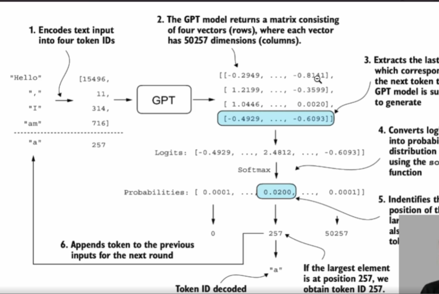

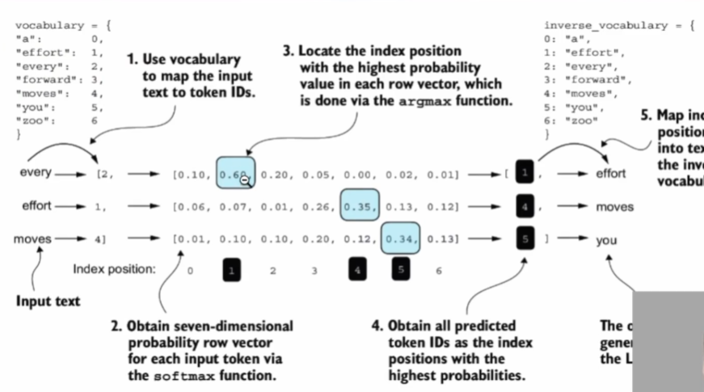

## 3. Training

### 3.1 Training Overview

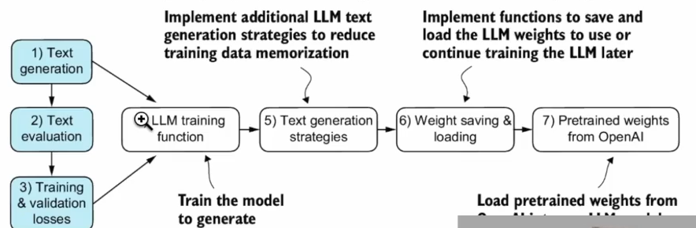

### 3.2 Model Sizes

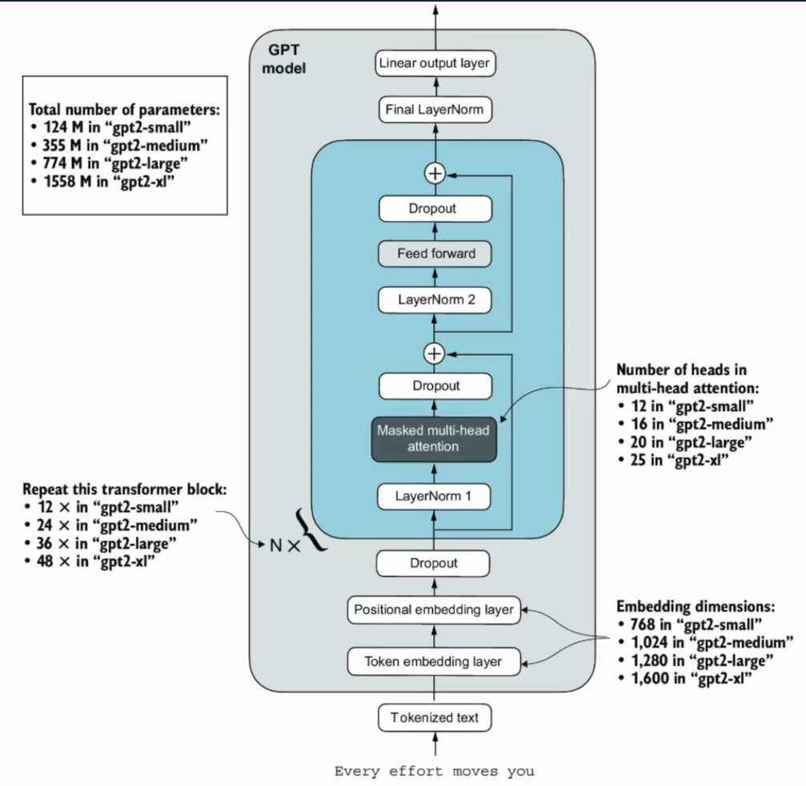

| Model | Parameters | Approximate download size |
| --- | ---: | ---: |
| GPT-2 Small | 124M | 500 MB |
| GPT-2 Medium | 355M | 1.4 GB |
| GPT-2 Large | 774M | 3.1 GB |
| GPT-2 XL | 1,558M | 6.2 GB |

Load a pretrained model with one of the following commands:

```powershell
python 5.5.LoadOpenAIWeights.py --model gpt2-small
python 5.5.LoadOpenAIWeights.py --model gpt2-medium
python 5.5.LoadOpenAIWeights.py --model gpt2-large
python 5.5.LoadOpenAIWeights.py --model gpt2-xl
```

## 4. Fine-Tuning

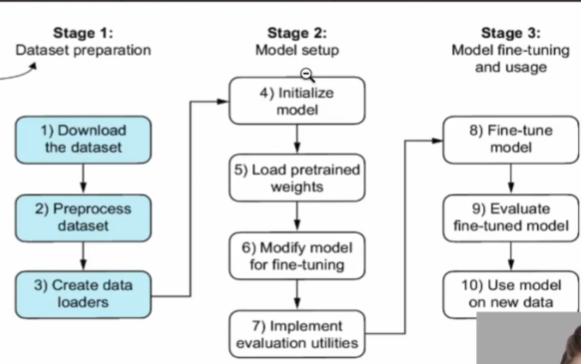

1. Download and preprocess the dataset, then create data loaders.
2. Initialize the model, load pretrained weights, and adapt it for fine-tuning (Modify last layer).
3. Fine-tune and evaluate the model, then use it to classify new data.
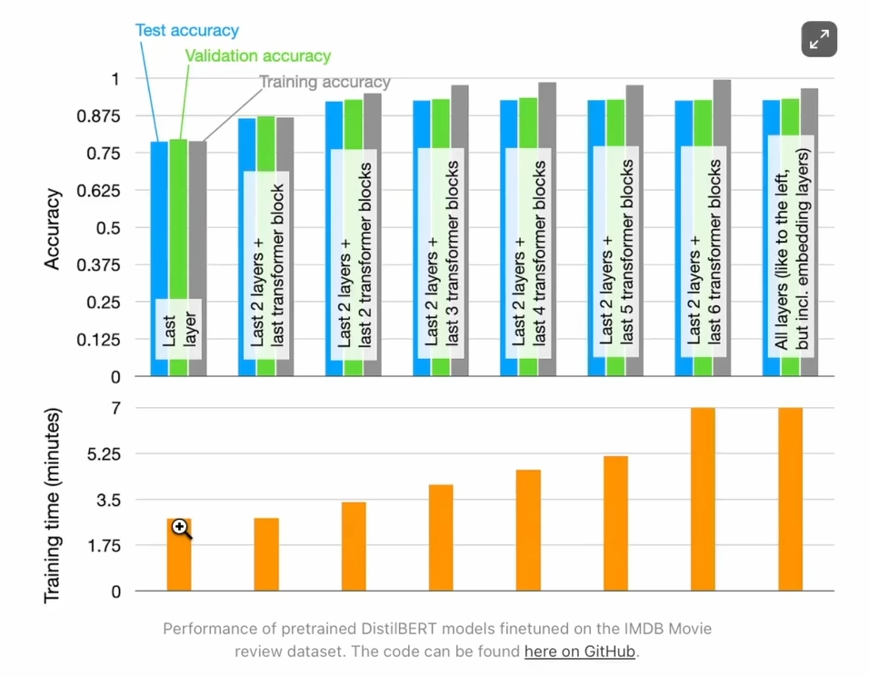

## 5. Getting Started

### 5.1 Create and Activate a Virtual Environment

```powershell
python -m venv .venv
.\.venv\Scripts\Activate.ps1
```

### 5.2 Install Dependencies

```powershell
pip install -r requirements.txt
```