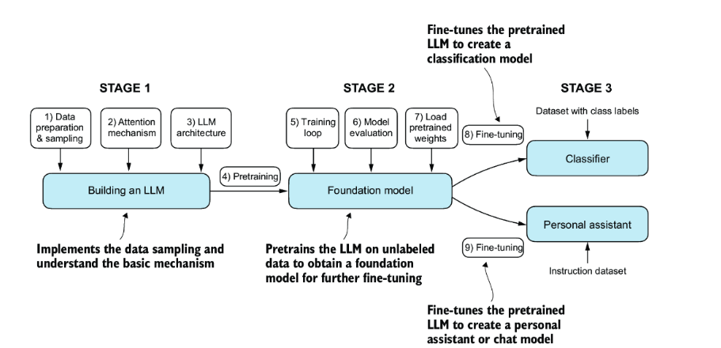
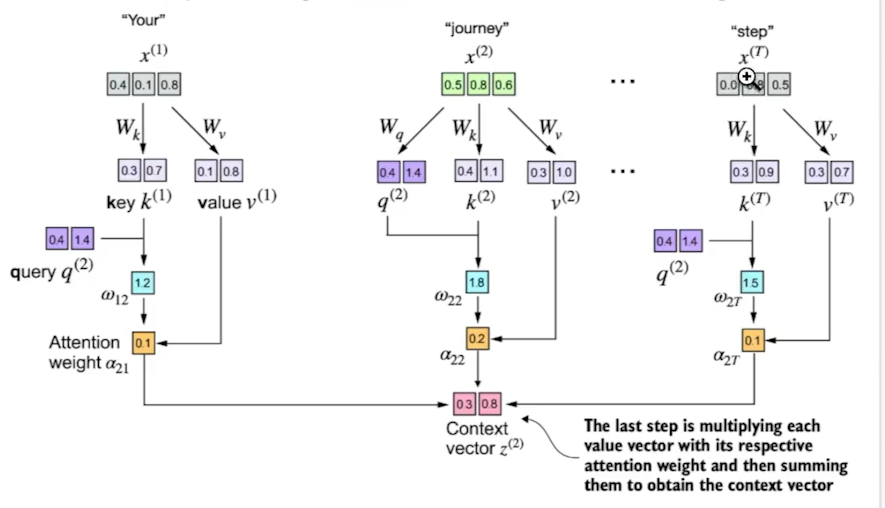
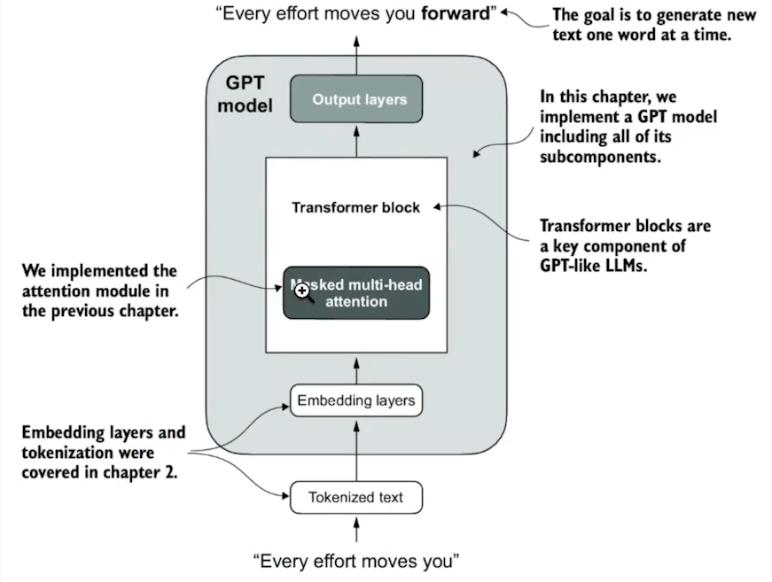
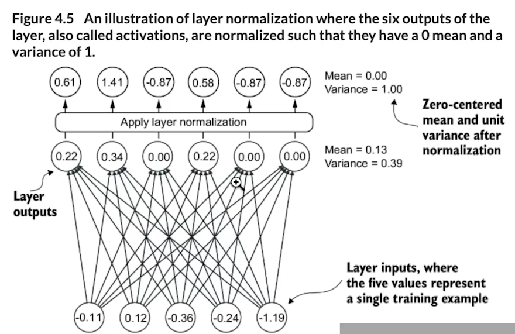
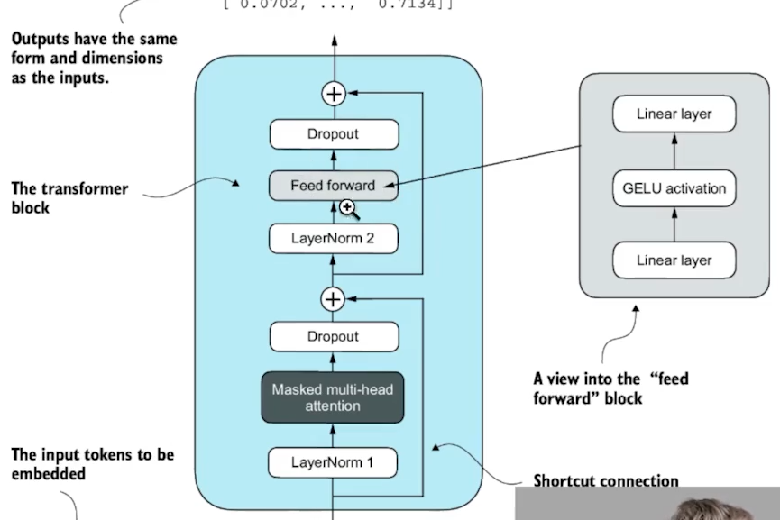
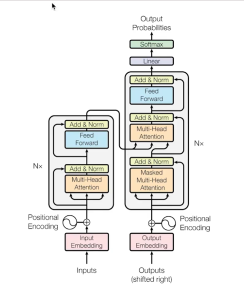

# SLM
Small Language Model from Scratch

For original code refer - https://github.com/rasbt/LLMs-from-scratch/blob/main/README.md

This repo holds code to build a small language model from Scratch

Flow:
=============
TokenizeEmbeddings
    Input text -> Tokenized Text-> Token IDs -> Token Embeddings -> Positional Embeddings -> Input Embeddings
    Chapter 2
    

Attention Mechanism
    1.Simplified Self-attention-> 2. Self-Attention -> 3. Causal Attention -> 4. Multi-Head Attention
    

LLM architecture
    
    
    4_2. Layer Normalization
    
    4_3. TransforerBlockInternals
    
    4.4 Shortcut Connection
    
    4.5 Transformer Block
    
    4.6 GPT Model
    4.7 Generate Text
    

Training:
    Overview 

To get started
=================
1) install the packages using command
pip install -r requirements.txt